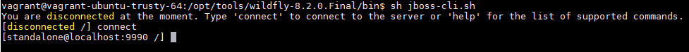

# Configuring your environment

This tutorial will help you to set the needed configuration to run the project in your system. The most commands are Unix platform but you can configure the project in a Windows too.

## How to install JDK
You can download [jdk](http://www.oracle.com/technetwork/pt/java/javase/downloads/jdk8-downloads-2133151.html), jdk-8uX-linux-X.tar.gz for linux or jdk-8uX-windows-X.exe for windows. Uncompress the file where you want, for instance `/opt/tools/jdk`.

You can configure java to run in terminal easy with these commands:
```shell
sudo update-alternatives --install /usr/bin/javac javac /opt/java/jdk1.6.0x32/bin/javac 1
sudo update-alternatives --install /usr/bin/java java /opt/java/jdk1.6.0x32/bin/java 1
sudo update-alternatives --install /usr/bin/javaws javaws /opt/java/jdk1.6.0x32/bin/javaws 1
```
Or you can configure your system environment variable in your `/etc/profile`, `/etc/bash.bashrc`, or `/etc/environment`.

## How to install Maven
You can download [maven](https://maven.apache.org/download.cgi#), apache-maven-3.x.x-bin.tar.gz for linux or apache-maven-3.x.x-bin.zip for windows. Uncompress the file where you want, for instance `/opt/tools/maven`.

You can configure maven to run in terminal easy with this command, `sudo update-alternatives --install /usr/bin/mvn mvn /opt/tools/maven 1`, or you can configure your system environment variable in your `/etc/profile`, `/etc/bash.bashrc`, or `/etc/environment`.

## How to install NodeJs and NPM

For install NodeJS you run `sudo apt-get install nodejs`, to test if it is working you can run `node -v` and see if terminal show the node version, if you get an trouble you can install another package to solve this problem, `sudo apt-get install nodejs-legacy`, nodejs-legacy package add a symbolic link from /usr/bin/node to /usr/bin/nodejs.

After this you can install npm package with `sudo apt-get install npm` to finish.

You can check if the install nodejs and npm version installed are the last version, check the version with `node -v` and `npm -v`, check if the versions are v7.2.0 to node and 3.10.9 to npm or higher. If it isn't run these commands:

```shell
sudo npm cache clean -f
sudo npm install -g n
sudo n stable
```

### Problem to run NPM packages

Sometimes you can get some trouble when you try to run npm packages like gulp. The terminal will show you gulp is not a command, to fix it you can `npm config set prefix /usr/local` to fix where npm will put its executable script, if you are using windows you can change the command to `npm config set prefix C:\Users\YourUser`.

## How to install bower and git

For install Bower you need to have NodeJS, NPM and Git installed previously. If you don't have git installed in your system, execute this command your terminal `sudo apt-get install git` and after it have done installed you can run `sudo apt-get install bower`.

## How to config PostgreSql driver in WildFly

This tutor will help you to config a driver on your wildfly server. All commands are for unix platform, if you are using windows, you can change the `*.sh files` with `*.bat files`.

### Configuring

First, go to your WildFly folder, go into bin folder. Execute `add-user.sh` to add a user if you haven’t already done. If you have any doubt, you can get help with this [link]( https://docs.jboss.org/author/display/WFLY8/add-user+utility?_sscc=t)

After execute the `standalone.sh` to start the server. For the next step run the `jboss-cli.sh`,  and then type connect to connect the server.



Now, to add postgres module in wildfly, download postgresql [driver](https://github.com/CodeShareEducation/java-service-order/raw/master/config/postgresql-9.4-1206-jdbc41.jar) in one folder of your choice, and run this command, `module add --name=org.postgres --resources=/tmp/postgresql-9.4-1206-jdbc41.jar --dependencies=javax.api,javax.transaction.api`.

Then we have to install the driver in the wildfly. `/subsystem=datasources/jdbc-driver=postgres:add(driver-name="postgres",driver-module-name="org.postgres",driver-class-name=org.postgresql.Driver)`.

## CORS with WildFly

Maybe when you run the angular application you will get the `No 'Access-Control-Allow-Origin' header is present on the requested resource. Origin 'http://localhost' is therefore not allowed access.`. To solve this you can edit you standalone.xml as follow:

```xml
<subsystem xmlns="urn:jboss:domain:undertow:1.1">
    <buffer-cache name="default"/>
    <server name="default-server">
        <http-listener name="default" socket-binding="http"/>
        <host name="default-host" alias="localhost">
            <location name="/" handler="welcome-content"/>
            <filter-ref name="server-header"/>
            <filter-ref name="x-powered-by-header"/>
            <filter-ref name="Access-Control-Allow-Origin"/>
            <filter-ref name="Access-Control-Allow-Methods"/>
            <filter-ref name="Access-Control-Allow-Headers"/>
            <filter-ref name="Access-Control-Allow-Credentials"/>
            <filter-ref name="Access-Control-Max-Age"/>
        </host>
    </server>
    ...
    <filters>
        <response-header name="server-header" header-name="Server" header-value="WildFly/8"/>
        <response-header name="x-powered-by-header" header-name="X-Powered-By" header-value="Undertow/1"/>
        <response-header name="Access-Control-Allow-Origin" header-name="Access-Control-Allow-Origin" header-value="*"/>
        <response-header name="Access-Control-Allow-Methods" header-name="Access-Control-Allow-Methods" header-value="GET, POST, OPTIONS, PUT"/>
        <response-header name="Access-Control-Allow-Headers" header-name="Access-Control-Allow-Headers" header-value="accept, authorization,  content-type, x-requested-with"/>
        <response-header name="Access-Control-Allow-Credentials" header-name="Access-Control-Allow-Credentials" header-value="true"/>
        <response-header name="Access-Control-Max-Age" header-name="Access-Control-Max-Age" header-value="1"/>
    </filters>
</subsystem>
```
